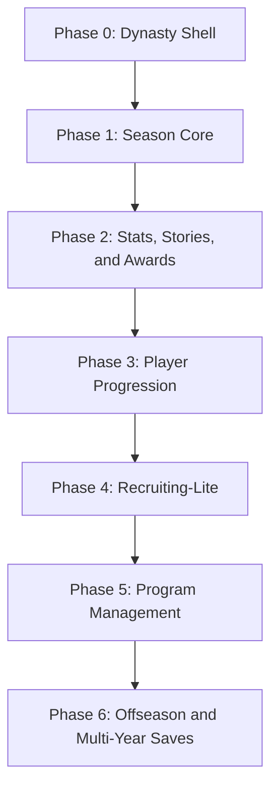

# Football JS Dynasty Decisions

## Purpose

Dynasty should become the long-term team-building mode for Football JS, but the first implementation should stay small enough to ship and test. The mode will use the existing fictional six-team league, roster identities, ratings, match stats, schedule-capable match flow, and deterministic simulation.

## Reference Scan

Public football-game references are useful for feature categories, not for copying presentation or exact mechanics.

- EA Sports College Football 26 public Dynasty material emphasizes long-term program systems such as recruiting, transfer portal, coaching carousel, coach abilities, program identity, Dynasty Central, and a broader weekly management loop.
- Madden NFL 26 public franchise material emphasizes a franchise hub, weekly strategy/actions, coach/player management, progression, presentation, and season-long context.
- Madden NFL 27 public franchise direction emphasizes deeper living-league behavior such as player personality, emergent actions, stronger staff/team management, and more dynamic franchise events.
- I did not find enough stable official CFB 27 Dynasty detail to rely on as implementation input, so CFB 27 remains a watch item rather than a requirement source.

Useful source links:

- [EA Sports College Football 26 Dynasty Deep Dive](https://www.ea.com/games/ea-sports-college-football/college-football-26/news/cfb26-campus-huddle-dynasty-deep-dive)
- [EA Sports Madden NFL 26 Franchise Deep Dive](https://www.ea.com/games/madden-nfl/madden-nfl-26/news/madden-nfl-26-franchise-deep-dive)
- [EA Sports Madden NFL 27 Franchise Mode](https://www.ea.com/games/madden-nfl/madden-nfl-27/news/madden-27-franchise-mode)

## Core Product Decision

Football JS Dynasty will start as a compact college-style program mode, not a full pro-franchise clone.

Chosen first depth:

- One user-controlled program.
- Six-team league schedule.
- Weekly hub with standings, upcoming game, roster snapshot, team strengths, and season goals.
- Deterministic simulation for non-user games.
- Season stats and simple leaders.
- End-of-season progression and roster turnover after the base loop is reliable.

Deferred:

- Full recruiting board.
- Transfer portal.
- Coach carousel.
- Staff tree.
- NIL/budget/facilities economy.
- Custom conferences.
- Full roster editing and substitutions.

## Phase Map

## Implementation Phases

### Phase 0: Dynasty Shell

Status: Complete in `1.22.0`.

Goal: Make Dynasty visible as a hub destination without starting a new mode.

Scope:

- Add Dynasty button in Football Hub.
- Show non-playable Dynasty overview.
- Link to this decision file.
- Keep Play Now flow unchanged.

Acceptance:

- No gameplay starts from the Dynasty shell.
- No duplicate team-selection path is introduced.
- Build passes.

Minor update plan:

1. Hub destination: add the Dynasty button in Football Hub while keeping Play Now as the playable path. Shipped in `1.22.0`.
2. Planning overview: show a non-playable Dynasty overview that explains the intended long-term mode direction. Shipped in `1.22.0`.
3. Decision-map link: point the Dynasty shell at this decision file so the rollout stays visible. Shipped in `1.22.0`.

Patch hardening plan:

1. Shell isolation hardening: keep Dynasty non-playable, avoid duplicate team-selection state, and leave Play Now flow unchanged. Shipped in `1.22.0`.

Completion notes:

- The Football Hub contains a Dynasty destination.
- The Dynasty destination is a non-playable planning shell.
- The shell points back to this decision map and keeps Play Now separate.

### Phase 1: Season Core

Status: Complete in `1.22.19`.

Goal: Create the first real dynasty save loop.

Scope:

- `DynastySaveData` schema and IndexedDB repository.
- Six-team season schedule.
- Standings table.
- Week advance.
- User game launch from weekly matchup.
- Simulate non-user games deterministically.

Acceptance:

- Same seed creates same schedule and results.
- Reloading restores the same week, standings, and user team.
- Play Now remains separate from Dynasty.

Minor update plan:

1. Season-core contract: add the `DynastySaveData` schema and deterministic six-team round-robin schedule generator. Shipped in `1.22.14`.
2. Save repository: persist, load, reset, and migrate the active dynasty save through IndexedDB. Shipped in `1.22.15`.
3. Dynasty hub view: show the active user program, current week, upcoming game, schedule, and standings in the Football Hub Dynasty tab. Shipped in `1.22.16`.
4. Weekly advance: simulate non-user games deterministically, update standings, and allow the user matchup to launch from the Dynasty path. Shipped in `1.22.17`.

Patch hardening plan:

1. Reload and migration hardening: validate corrupt saves, missing teams, stale schema versions, and safe fallback behavior. Shipped in `1.22.18`.
2. Flow hardening: prevent Play Now and Dynasty state from leaking into each other, including team settings, kickoff setup, and completed-game return routing. Shipped in `1.22.19`.

Completion notes:

- The Dynasty hub loads, creates, and persists the active save through the repository.
- Weekly non-user games and quick-sim user games update standings deterministically.
- Dynasty matchup launch settings are runtime-only, and Play Now settings remain separate.

### Phase 2: Stats, Stories, and Awards

Status: Complete in `1.22.25`.

Goal: Let the season feel persistent through stats and commentary.

Scope:

- Team and player season stat aggregation from `GameStatsModel`.
- Weekly leaders.
- Basic award watch lists.
- Postgame and halftime story hooks can read season context.

Acceptance:

- Simulated and user-played games produce valid cumulative stats.
- No impossible stats are generated.
- Commentary remains generic and factual.

Minor update plan:

1. Season stats contract: add team-level season stat rows, deterministic per-game stat lines, aggregate rebuilds, and legacy stat hydration. Shipped in `1.22.20`.
2. Weekly leaders: expose passing, rushing, scoring, turnover, and yardage leaders from the current Dynasty save. Shipped in `1.22.21`.
3. Story hooks: add compact Dynasty context summaries for halftime, postgame, and weekly hub copy. Shipped in `1.22.22`.
4. Award watch lists: add deterministic offensive, defensive, and special teams watch rows based on season stats. Shipped in `1.22.23`.

Patch hardening plan:

1. Stat validation hardening: reject missing, negative, mismatched, or impossible aggregate stat rows and preserve migration safety. Shipped in `1.22.24`.
2. Story presentation hardening: keep Dynasty story copy generic, factual, and absent from Play Now unless a Dynasty context exists. Shipped in `1.22.25`.

Completion notes:

- Dynasty saves now carry cumulative team season stats, weekly leaders, award watch rows, and compact story context for the hub, halftime report, and postgame stats.
- Dynasty validation rejects corrupt stat aggregates and missing, duplicate, negative, or mismatched stat rows.
- Dynasty story copy is suppressed for Play Now and for malformed Dynasty context.

### Phase 3: Player Progression

Status: Complete in `1.22.31`.

Goal: Make roster identity matter over time.

Scope:

- End-of-game XP or performance points.
- End-of-week training summary.
- Small rating changes based on position and archetype.
- Regression or fatigue-like modifiers stay presentation-only at first.

Acceptance:

- Rating changes are bounded and deterministic.
- Overall recalculates from attribute weights.
- Gameplay behavior does not change until explicitly approved.

Minor update plan:

1. Progression preview contract: add deterministic presentation-only performance points from current Dynasty season stats without mutating roster ratings. Shipped in `1.22.26`.
2. Weekly training summary: add a compact hub section that groups projected development by position room and archetype. Shipped in `1.22.27`.
3. Rating delta preview: calculate bounded projected attribute and overall changes based on position weights, still not applied to gameplay. Shipped in `1.22.28`.
4. Apply-to-save progression: persist approved end-of-week progression rows and roster rating deltas in Dynasty save data. Shipped in `1.22.29`.

Patch hardening plan:

1. Progression bounds hardening: reject negative, non-integer, oversized, or duplicate progression rows during save validation. Shipped in `1.22.30`.
2. Gameplay isolation hardening: prove progression previews and saved deltas cannot alter live gameplay ratings until explicitly applied through the approved path. Shipped in `1.22.31`.

Completion notes:

- Dynasty progression previews now generate deterministic performance points, training summaries, and bounded projected rating deltas from current season stats.
- Approved progression applications persist player/week rating delta history in the save without mutating roster registry ratings.
- Save validation rejects malformed, negative, non-integer, oversized, empty-delta, duplicate, or invalid progression application rows, and gameplay roster bindings ignore saved deltas until a future explicit apply path exists.

### Phase 4: Recruiting-Lite

Status: Complete in `1.22.37`.

Goal: Add a compact college-style roster-building layer.

Scope:

- Small prospect pool.
- Team needs.
- Weekly recruiting points.
- Three pitch styles: playing time, team strength, program fit.
- Signing class at season end.

Acceptance:

- Recruiting can be completed in one simple weekly screen.
- Prospects are fictional and deterministic.
- Existing roster size constraints remain valid.

Minor update plan:

1. Prospect pool contract: add deterministic fictional prospects, position/archetype metadata, star grades, and three pitch-style fit scores without changing rosters. Shipped in `1.22.32`.
2. Team needs view: derive compact recruiting needs from current roster composition and ratings. Shipped in `1.22.33`.
3. Weekly recruiting points: add a simple points allocation model for the user program. Shipped in `1.22.34`.
4. Signing class preview: summarize likely signees and class fit without mutating rosters until offseason work. Shipped in `1.22.35`.

Patch hardening plan:

1. Recruiting validation hardening: reject duplicate prospects, invalid pitch scores, impossible grades, and malformed interest rows. Shipped in `1.22.36`.
2. Roster safety hardening: prove recruiting views and saved allocations cannot change active roster size or gameplay lineups before the offseason apply path. Shipped in `1.22.37`.

Completion notes:

- Dynasty Recruiting-Lite now creates a deterministic fictional prospect pool, compact team needs, weekly point allocations, and a signing class preview without mutating active rosters.
- Recruiting validation rejects malformed prospects, duplicate IDs, duplicate team interest rows, impossible grades, and invalid pitch fit scores.
- Recruiting roster safety snapshots and gameplay binding checks prove recruiting allocations and signing previews remain isolated from roster sizes, starter IDs, specialist IDs, and active gameplay lineups until a future offseason apply path exists.

### Phase 5: Program Management

Status: Complete in `1.22.43`.

Goal: Add strategic program identity without overwhelming the player.

Scope:

- Coach goals.
- Program strengths.
- Simple budget allocation between recruiting, training, facilities, and staff.
- Staff modifiers as small deterministic bonuses.

Acceptance:

- Every modifier is visible and testable.
- No hidden comeback or rubber-band logic.
- Budget choices affect future phases, not current-play outcomes.

Minor update plan:

1. Coach goals contract: add visible weekly and season program goals derived from save state without changing gameplay outcomes. Shipped in `1.22.38`.
2. Program strengths view: summarize the user program's identity from roster ratings, team stats, and standings. Shipped in `1.22.39`.
3. Budget allocation model: add a simple visible allocation between recruiting, training, facilities, and staff. Shipped in `1.22.40`.
4. Staff modifiers preview: show small deterministic staff bonuses as future-phase inputs, not current-play effects. Shipped in `1.22.41`.

Patch hardening plan:

1. Program management validation hardening: reject malformed goals, budget totals, hidden modifiers, and out-of-range bonus values. Shipped in `1.22.42`.
2. Gameplay isolation hardening: prove program goals, budgets, and staff modifiers cannot alter current-play ratings, movement, or simulation results before approved apply paths exist. Shipped in `1.22.43`.

Completion notes:

- Dynasty Program Management now exposes visible coach goals, ranked program strengths, 100-point budget allocations, and small staff modifier previews.
- Program Management validation rejects malformed goals, duplicate categories, invalid budget totals, hidden current-play modifier labels, and out-of-range staff bonuses.
- Program Management previews are future-phase-only and gameplay isolation coverage proves they do not alter roster ratings, movement profiles, active lineup bindings, or deterministic simulation results.

### Phase 6: Offseason and Multi-Year Saves

Status: Complete in `1.22.49`.

Goal: Close the long-term loop.

Scope:

- Departures.
- Incoming class.
- Roster review.
- Schedule generation for next season.
- Dynasty history.

Acceptance:

- Multiple seasons can be advanced without corrupting rosters.
- Team history and season records persist.
- Save migration handles schema changes.

Minor update plan:

1. Departures preview contract: add deterministic offseason departure candidates from roster identity and season status without mutating rosters. Shipped in `1.22.44`.
2. Incoming class preview: connect recruiting signing previews to an offseason incoming class without mutating rosters. Shipped in `1.22.45`.
3. Roster review: show returning, departing, and incoming balance with position gaps. Shipped in `1.22.46`.
4. Next-season schedule and history: generate the next season shell and preserve season history rows. Shipped in `1.22.47`.

Patch hardening plan:

1. Offseason validation hardening: reject malformed departures, incoming class rows, roster review rows, duplicate history entries, and invalid next-season metadata. Shipped in `1.22.48`.
2. Multi-year save isolation hardening: prove offseason previews and next-season shells cannot corrupt active roster registry, current-season results, or save migration paths. Shipped in `1.22.49`.

Completion notes:

- Dynasty Offseason now exposes deterministic departure previews, incoming class previews, roster review rows, and next-season schedule/history shells without mutating active roster data.
- Offseason validation rejects malformed departure candidates, incoming candidates, roster-review totals, duplicate history rows, bad history math, and invalid next-season metadata.
- Multi-year isolation coverage proves offseason previews and next-season shells do not alter current-season results, roster registry snapshots, valid save validation, or save repository reload behavior.

## Open Decisions

- Should Dynasty start with user-only gameplay and fully simulated opponent drives, or require Play Now match flow for every user game?
- Should season length be five games, round-robin, or a configurable short schedule?
- Should recruiting appear before or after player progression?
- Should all six teams recruit simultaneously in Phase 4, or should opponents receive simulated class strength only?
- Should Dynasty use separate presentation commentary categories, or reuse existing game/opinion lines first?

## Non-Copying Guardrails

- Use original Football JS layout and terminology.
- Do not copy EA menu structure, feature names, art direction, or exact flows.
- Do not use real teams, real players, real coaches, real conferences, or protected branding.
- Treat commercial games as category references only.
